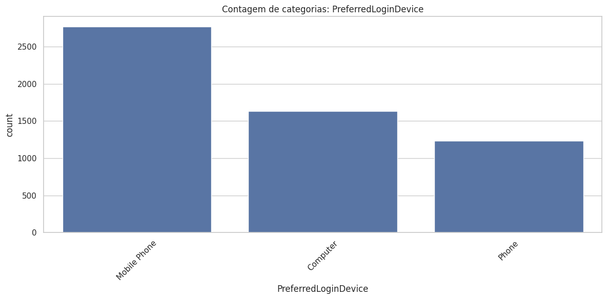
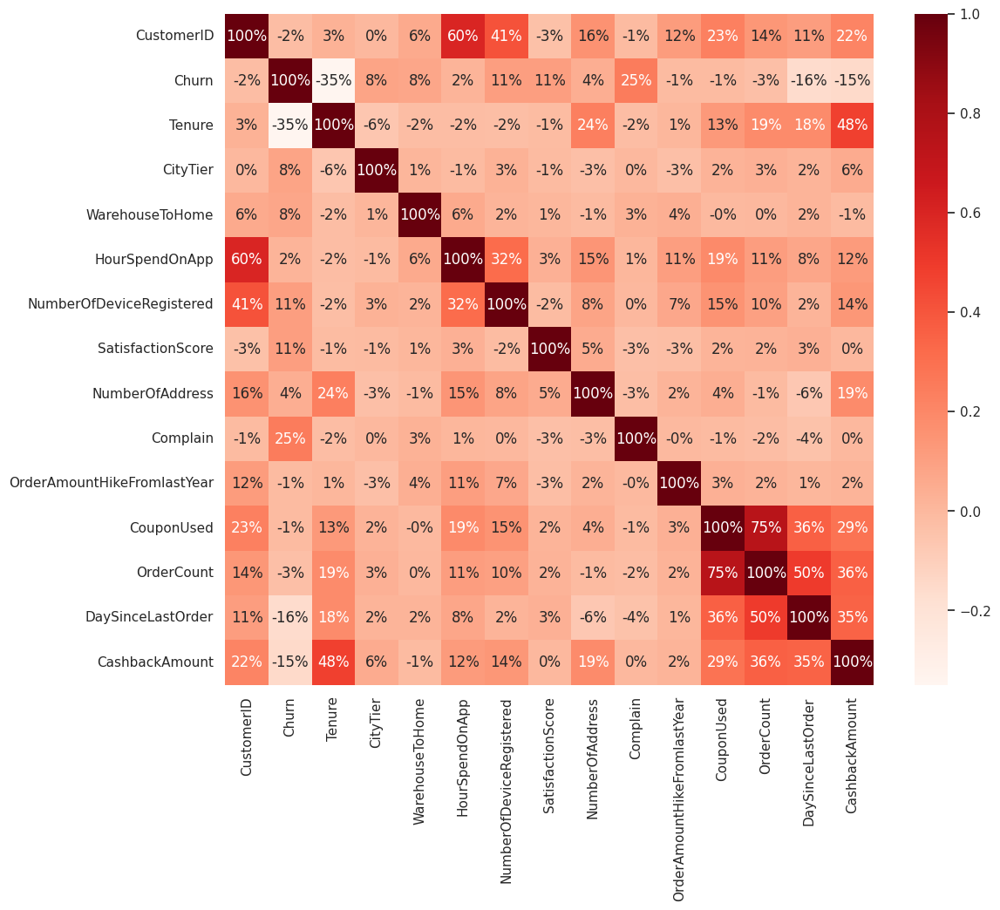

# Customer Churn Analysis

This repository presents a logistic regression model built with PyTorch to predict e-commerce customer churn. The dataset used and some preprocessing steps were obtained from Dmytro Voytko's repository:  
[https://github.com/dmytrovoytko/MLOps-churn-prediction](https://github.com/dmytrovoytko/MLOps-churn-prediction)

---

## Exploratory Data Analysis

The dataset contains **5,630 records** and **20 columns**, including numerical and categorical features. Below is a summary of all features present:

- `CustomerID`
- `Churn` *(target variable)*
- `Tenure`
- `PreferredLoginDevice`
- `CityTier`
- `WarehouseToHome`
- `PreferredPaymentMode`
- `Gender`
- `HourSpendOnApp`
- `NumberOfDeviceRegistered`
- `PreferedOrderCat`
- `SatisfactionScore`
- `MaritalStatus`
- `NumberOfAddress`
- `Complain`
- `OrderAmountHikeFromlastYear`
- `CouponUsed`
- `OrderCount`
- `DaySinceLastOrder`
- `CashbackAmount`

Column types include `int64`, `float64`, and `object`. The `Churn` column indicates whether a customer has left the platform.

For more details, refer to the full [Jupyter Notebook EDA](./exploratory_data_analysis.ipynb).

Histograms for each numerical feature are available, such as the one shown below for `CashbackAmount`:  

Bar plots are also provided for each categorical (`object`) feature, such as `PreferredLoginDevice`:  

---

## Categorical Variable Analysis

Bar plots were used to visually inspect the distribution of categorical and discrete variables. This analysis helps to better understand customer behavior across different segments, such as preferred device, payment mode, and order category.

---

## Missing Value Analysis

Approximately 5% of the dataset contains missing values. The table below summarizes the extent of missingness:

| Feature                       | Missing | Percent   |
|-------------------------------|---------|-----------|
| DaySinceLastOrder             | 307     | 5.45%     |
| OrderAmountHikeFromlastYear   | 265     | 4.71%     |
| Tenure                        | 264     | 4.69%     |
| OrderCount                    | 258     | 4.58%     |
| CouponUsed                    | 256     | 4.55%     |
| HourSpendOnApp                | 255     | 4.53%     |
| WarehouseToHome               | 251     | 4.46%     |

These fields require attention during preprocessing, as their absence may indicate behavioral patterns such as inactivity or disengagement.

---

## Numerical Variable Analysis

Histograms and density plots were used to explore the distribution of numerical features. Some key observations:

- **Tenure:** Longer tenure is linked to a lower chance of churn.
- **Complain:** Customers who filed complaints are more likely to churn.
- **DaySinceLastOrder:** A larger number of days since the last order correlates with higher churn probability.
- **CashbackAmount:** Higher cashback amounts are associated with customer retention.

These trends help to identify both churn risk factors and loyalty indicators.

---

## Correlation with Churn

Correlation analysis with the target variable `Churn` showed the following relationships:

| Feature                       | Correlation with `Churn` |
|-------------------------------|---------------------------|
| Complain                      | **+0.25**                 |
| Tenure                        | **-0.35**                 |
| DaySinceLastOrder             | -0.16                     |
| CashbackAmount                | -0.15                     |
| NumberOfDeviceRegistered      | +0.11                     |
| SatisfactionScore             | +0.11                     |
| CityTier                      | +0.08                     |
| WarehouseToHome               | +0.08                     |
| NumberOfAddress               | +0.04                     |
| HourSpendOnApp                | +0.02                     |
| OrderCount                    | -0.03                     |
| CustomerID                    | -0.02                     |
| OrderAmountHikeFromlastYear   | -0.01                     |
| CouponUsed                    | -0.01                     |

Key takeaways:

- **Complaints** are a strong positive indicator of churn.
- **Tenure** has the strongest negative correlation, reinforcing that long-time customers are less likely to churn.
- **Engagement metrics** such as `DaySinceLastOrder` and `CashbackAmount` show moderate negative correlations, suggesting that recency and rewards reduce churn risk.
- Some variables have weak or negligible correlation with churn and may require further feature engineering.

---

## Profiling Report

A full profiling report was generated using `ydata-profiling`, which includes statistics, distributions, correlations, and potential outliers. It is useful for identifying early patterns and data quality issues.  
👉 [Click here to view the report](./Profile_Report.html)

---

## Conclusion

This exploratory analysis highlights the key variables affecting customer churn in an e-commerce setting. Behavioral factors like **complaints**, **tenure**, **engagement frequency**, and **cashback incentives** show the strongest relationships. These insights are crucial for developing effective churn prediction models and customer retention strategies.
