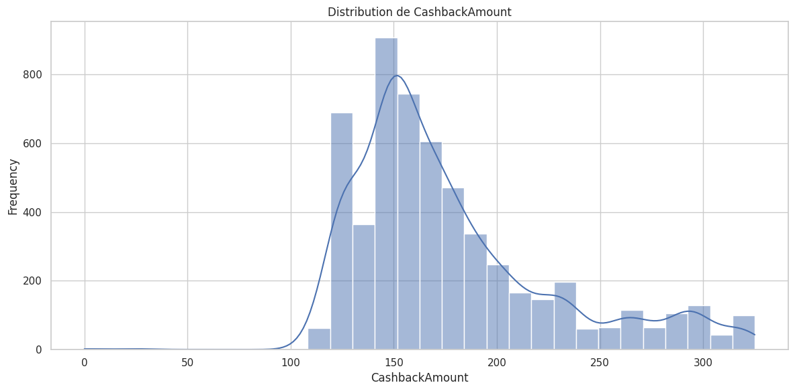
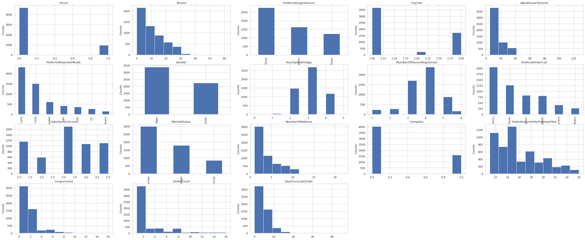

# Customer Churn 

> **Author: João Igor Ramos de Lima**

This repository presents a logistic regression model built with PyTorch to predict e-commerce customer churn. The dataset used and some preprocessing steps were obtained from Dmytro Voytko's repository:  

[https://github.com/dmytrovoytko/MLOps-churn-prediction](https://github.com/dmytrovoytko/MLOps-churn-prediction)

---

# Exploratory Data Analysis

The dataset contains **5,630 records** and **20 columns**, including numerical and categorical features. Below is a summary of all features present:

- `CustomerID`
- `Churn` *(target variable)*
- `Tenure`
- `PreferredLoginDevice`
- `CityTier`
- `WarehouseToHome`
- `PreferredPaymentMode`
- `Gender`
- `HourSpendOnApp`
- `NumberOfDeviceRegistered`
- `PreferedOrderCat`
- `SatisfactionScore`
- `MaritalStatus`
- `NumberOfAddress`
- `Complain`
- `OrderAmountHikeFromlastYear`
- `CouponUsed`
- `OrderCount`
- `DaySinceLastOrder`
- `CashbackAmount`

Column types include `int64`, `float64`, and `object`. The `Churn` column indicates whether a customer has left the platform.

For more details, refer to the full [Jupyter Notebook EDA](./exploratory_data_analysis.ipynb).

Histograms for each numerical feature are available, such as the one shown below for `CashbackAmount`:  


Bar plots are also provided for each categorical (`object`) feature, such as `PreferredLoginDevice`:  


---

## Categorical Variable Analysis

Bar plots were used to visually inspect the distribution of categorical and discrete variables. This analysis helps to better understand customer behavior across different segments, such as preferred device, payment mode, and order category.



---

## Missing Value Analysis

Approximately 5% of the dataset contains missing values. The table below summarizes the extent of missingness:

| Feature                       | Missing | Percent   |
|-------------------------------|---------|-----------|
| DaySinceLastOrder             | 307     | 5.45%     |
| OrderAmountHikeFromlastYear   | 265     | 4.71%     |
| Tenure                        | 264     | 4.69%     |
| OrderCount                    | 258     | 4.58%     |
| CouponUsed                    | 256     | 4.55%     |
| HourSpendOnApp                | 255     | 4.53%     |
| WarehouseToHome               | 251     | 4.46%     |

These fields require attention during preprocessing, as their absence may indicate behavioral patterns such as inactivity or disengagement.

---

## Numerical Variable Analysis

Histograms and density plots were used to explore the distribution of numerical features. Some key observations:

- **Tenure:** Longer tenure is linked to a lower chance of churn.
- **Complain:** Customers who filed complaints are more likely to churn.
- **DaySinceLastOrder:** A larger number of days since the last order correlates with higher churn probability.
- **CashbackAmount:** Higher cashback amounts are associated with customer retention.

These trends help to identify both churn risk factors and loyalty indicators.

---

## Correlation with Churn

Correlation analysis with the target variable `Churn` showed the following relationships:

| Feature                       | Correlation with `Churn` |
|-------------------------------|---------------------------|
| Complain                      | **+0.25**                 |
| Tenure                        | **-0.35**                 |
| DaySinceLastOrder             | -0.16                     |
| CashbackAmount                | -0.15                     |
| NumberOfDeviceRegistered      | +0.11                     |
| SatisfactionScore             | +0.11                     |
| CityTier                      | +0.08                     |
| WarehouseToHome               | +0.08                     |
| NumberOfAddress               | +0.04                     |
| HourSpendOnApp                | +0.02                     |
| OrderCount                    | -0.03                     |
| CustomerID                    | -0.02                     |
| OrderAmountHikeFromlastYear   | -0.01                     |
| CouponUsed                    | -0.01                     |

Key takeaways:

- **Complaints** are a strong positive indicator of churn.
- **Tenure** has the strongest negative correlation, reinforcing that long-time customers are less likely to churn.
- **Engagement metrics** such as `DaySinceLastOrder` and `CashbackAmount` show moderate negative correlations, suggesting that recency and rewards reduce churn risk.
- Some variables have weak or negligible correlation with churn and may require further feature engineering.


---

## Profiling Report

A full profiling report was generated using `ydata-profiling`, which includes statistics, distributions, correlations, and potential outliers. It is useful for identifying early patterns and data quality issues.  
👉 [Click here to view the report](./Profile_Report.html)

---

# Preprocessing

To prepare the dataset for modeling, we implemented a dedicated preprocessing pipeline in [preprocess.py](./classes/preprocess.py). This script handles missing values, encodes categorical variables, and optionally removes outliers. The steps include:

1. **Dropping Irrelevant Columns** 
    - The column `CustomerID` was dropped as it does not provide predictive value for churn.

2. **Handling Missing Values**
    - Features with missing values were identified (e.g., `Tenure`, `DaySinceLastOrder`, `OrderAmountHikeFromlastYear`, etc.).
    - All missing values were imputed using the **median** of each column to avoid introducing bias and to maintain robustness against outliers.

3. **Outlier Removal (Optional)**
    - The script includes an optional flag (`REMOVE_OUTLIERS`) to remove outliers.
    - When enabled, outliers in the `Tenure` feature are removed using the **Interquartile Range (IQR)** method with configurable thresholds.

4. **Encoding Categorical Variables**
    - All categorical (non-numeric) columns are encoded using `OrdinalEncoder` from `sklearn`, preserving the ability to decode them later.
    - If `fit_enc=True`, the encoder is fitted and the categories are stored. Otherwise, a pre-fitted encoder is used to transform unseen data.

5. **Final Output**
    - After preprocessing, the cleaned dataset is saved in `clean_data.pkl` and returned for model training or further analysis.

## Usage

``` bash
cd resources
python preprocess.py
```

This will read the raw dataset (`E Commerce Dataset.xlsx.csv`), apply all preprocessing steps, and save the output as a pickle file.

---

# Architecture Class

The `Architecture` class provides a high-level abstraction to manage the training and evaluation of PyTorch models. It handles key components such as the model, optimizer, and loss function, and automates tasks like device management, training and validation steps, loss tracking, and checkpointing.

This class simplifies the machine learning workflow by encapsulating the logic for training loops, mini-batch handling, prediction, and loss visualization. Users can also set data loaders, switch devices (CPU/GPU), save and load training progress, and monitor performance over epochs using built-in utilities.

## Usage

``` bash
from resources/architecture import Architecture
arch = Architecture(model, loss_fn, optimizer)
```

--- 

# Trainer Class

The `Trainer` class is a high-level utility designed to streamline the entire machine learning pipeline, from data loading to model training, using PyTorch and Scikit-learn.

It automates the following tasks:
- **Loading and preprocessing data** from a `.pkl` file.
- **Splitting the dataset** into training and validation sets.
- **Standardizing features** using `StandardScaler`.
- **Converting data to PyTorch tensors** and creating data loaders.
- **Building a simple neural network model** with a single linear layer for binary classification.
- **Instantiating the loss function and optimizer**.
- **Integrating with the `Architecture` class** to handle the training loop and evaluation.

## Parameter Choices

- `batch_size=64`: A commonly used value that balances training stability and GPU memory usage.
- `lr=0.05`: A relatively high learning rate for faster convergence in simple models.
- `test_size=0.2`: Reserves 20% of the data for validation, a standard choice to avoid overfitting.
- `seed=42`: Ensures reproducibility of results by fixing the random number generator.
- `optimizer=SGD`: The Stochastic Gradient Descent optimizer is a solid baseline for training simple models.
- `loss=BCEWithLogitsLoss`: Combines a sigmoid layer and binary cross-entropy loss, suitable for binary classification tasks.
- `epochs=100` (default), `epochs=200` (used during training): More epochs allow the model to learn better patterns, especially in simple architectures.

## Usage

``` bash
from resources/trainer import Trainer

trainer = Trainer()
arch, scaler = trainer.train()
```

---

# Predictor Class

The `Predictor` class is designed to evaluate a trained machine learning model using standard classification metrics and visualizations. It builds upon the `Architecture` and `Trainer` classes to streamline the process of loading validation data and generating predictions.

Key functionalities include:
- **Loading and preprocessing validation data** using the same pipeline as training.
- **Generating predictions** from the trained model.
- **Calculating evaluation metrics** such as accuracy, precision, recall, F1-score, ROC AUC, and Precision-Recall AUC.
- **Displaying a confusion matrix** and plotting **ROC and Precision-Recall curves** for performance visualization.

## Threshold Choice

- `probs >= 0.3`: A custom threshold lower than the usual 0.5 to **increase recall**, which may be useful in imbalanced datasets or when false negatives are more costly than false positives.

## Usage

``` bash
from resources/predictor import Predictor

predictor = Predictor(arch)
predictor.run()
```

--- 

# 📈 Model Results

## Evaluation Metrics

| Metric         | Value |
|----------------|-------|
| Accuracy       | 0.88  |
| Precision      | 0.62  |
| Recall         | 0.71  |
| F1-score       | 0.67  |
| AUC-ROC        | 0.87  |
| AUC-PR         | 0.70  |

## Confusion Matrix

|                | Predicted 0 | Predicted 1 |
|----------------|-------------|-------------|
| Actual 0       | 861         | 80          |
| Actual 1       | 55          | 130         |

## Loss Curves


- The model shows **fast convergence**, stabilizing around epoch 30.
- The **gap between training and validation loss remains small**, suggesting low overfitting and good generalization.

## Evaluation Curves


- **ROC Curve (AUC = 0.87)**: Demonstrates strong ability to distinguish between the two classes.
- **Precision-Recall Curve (AUC = 0.70)**: Indicates solid performance in retrieving positive samples, especially relevant in imbalanced data contexts.

## Conclusion

- The model achieves **high overall accuracy (88%)**, showing consistent predictions across classes.
- **Precision (62%)** indicates a moderate rate of false positives—acceptable depending on the cost of such errors.
- **Recall (71%)** reflects a decent ability to detect true positives, although some positive cases are still missed.
- **F1-score (0.67)** balances both precision and recall, showing the model is reasonably effective for the task.
- The **high AUC-ROC (0.87)** confirms strong class separation, while the **AUC-PR (0.70)** reinforces its robustness in identifying relevant positive samples, even in potentially imbalanced data.

📌 Overall, the model offers a good trade-off between sensitivity and specificity, making it a reliable baseline for further improvements or deployment in real-world scenarios.

--- 

# OptimizedTrainer Class

The `OptimizedTrainer` class is an enhanced version of the original `Trainer` class. It replaces the simple logistic regression model with a deep, regularized neural network, offering better modeling capacity and generalization.

## Key Improvements and Architecture

This upgraded class introduces:

- A multi-layer feedforward neural network featuring:
    - Dense linear layers.
    - ReLU activation functions.
    - Batch Normalization for faster and more stable training.
    - Dropout to reduce overfitting.
- The Adam optimizer, known for its efficiency and adaptability in deep learning tasks.
- The loss function remains `BCEWithLogitsLoss`, suitable for binary classification.
- More control over random seed and number of training epochs via parameters.

## Parameters Used

- `batch_size = 64`: A balanced mini-batch size for training speed and stable gradient estimation.
- `lr = 0.001`: A conservative learning rate ideal for Adam optimizer.
- `test_size = 0.2`: Standard training/validation split.
- `seed = 13`: Ensures reproducibility.
- `n_epochs = 300`: Gives the deeper model enough time to converge.

## Usage

``` bash
from optimized_trainer import OptimizedTrainer
from predictor import Predictor

trainer = OptimizedTrainer()
arch, scaler = trainer.train(n_epochs=300)

predictor = Predictor(arch)
predictor.run()
arch.plot_losses()
```

## Neural Network Model Performance Evaluation

The neural network was trained using a custom `OptimizedTrainer` class for 300 epochs. Below are the key performance metrics and visualizations for the binary classification task:

### 🔍 Performance Metrics

| Metric        | Value   |
|---------------|---------|
| **Accuracy**  | 0.9627  |
| **Precision** | 0.8265  |
| **Recall**    | 0.9784  |
| **F1-Score**  | 0.8960  |
| **AUC-ROC**   | 0.9965  |
| **AUC-PR**    | 0.9869  |

These metrics indicate a highly performant model, especially for imbalanced datasets:

- **High Recall (0.9784)** means that the model successfully identifies the vast majority of positive instances (e.g., customers who will churn).
- **High Precision (0.8265)** shows that most of the predicted positives are indeed correct.
- **F1-Score (0.8960)** balances precision and recall, confirming overall robustness.
- **AUC-ROC (0.9965)** and **AUC-PR (0.9869)** close to 1 indicate excellent discrimination capacity between classes.

### 📊 Confusion Matrix

|              | Predicted Negative | Predicted Positive |
|--------------|--------------------|--------------------|
| **Actual Negative** | 903 (TN)           | 38 (FP)            |
| **Actual Positive** | 4 (FN)            | 181 (TP)           |

The confusion matrix shows a **very low number of false negatives**, which is crucial in scenarios where missing a positive case (e.g., a customer who will churn) is costly.

### 📈 Visualizations

#### ROC and Precision-Recall Curves

- The **ROC curve** shows a near-perfect performance with an AUC of **0.9965**.
- The **Precision-Recall curve** indicates strong performance in identifying the minority class, with an AUC of **0.9869**.

#### Loss Curves

The training and validation loss curves demonstrate:

- A smooth and consistent decrease in both training and validation loss.
- No significant overfitting, as the validation loss closely follows the training loss throughout the epochs.

  


